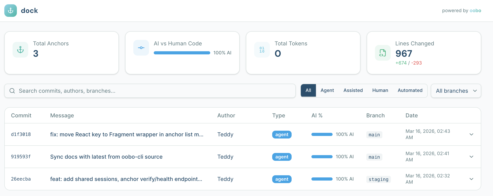

# dock

Self-hosted backend for all your anchors. Clone, fork, deploy, own your AI commit history.



**Dock** is a lightweight, open-source [Next.js](https://nextjs.org) app that implements the [oobo](https://github.com/ooboai/oobo) `/anchors` backend API. Clone it, set two env vars, deploy to Vercel (or anywhere with Postgres), and your `oobo` CLI starts syncing AI commit metadata to your own server.

## Quick Start

1. **Create a free Supabase project** at [supabase.com](https://supabase.com) — copy the connection string

2. **Clone and install:**

```bash
git clone https://github.com/ooboai/dock && cd dock
cp .env.example .env.local
```

3. **Fill in your `.env.local`:**

```env
DATABASE_URL="postgresql://..."       # Your Postgres connection string
SECRET_API_KEY="your-secret-key"      # Pick any secret string
```

4. **Set up and run:**

```bash
npm install
npx prisma db push
npm run dev
```

5. **Point your oobo CLI:**

```bash
oobo auth set-remote http://localhost:3000/api
oobo auth login --key <your SECRET_API_KEY>
```

6. **Make a commit with oobo** — it appears in your dashboard at [localhost:3000](http://localhost:3000)

## Deploy to Vercel

[](https://vercel.com/new/clone?repository-url=https%3A%2F%2Fgithub.com%2Fooboai%2Fdock&env=DATABASE_URL,SECRET_API_KEY&envDescription=Postgres%20connection%20string%20and%20API%20key%20for%20oobo%20CLI%20authentication&envLink=https%3A%2F%2Fgithub.com%2Fooboai%2Fdock%23environment-variables)

1. Click the button above (or `vercel deploy` from the CLI)
2. Add your `DATABASE_URL` and `SECRET_API_KEY` environment variables
3. Deploy — Vercel runs `prisma generate` automatically via the `postinstall` script
4. Run `npx prisma db push` once against your production database to create the tables
5. Update your oobo CLI remote:

```bash
oobo auth set-remote https://your-dock.vercel.app/api
oobo auth login --key <your SECRET_API_KEY>
```

## Environment Variables

| Variable | Required | Description |
|----------|----------|-------------|
| `DATABASE_URL` | Yes | Postgres connection string (Supabase, Neon, Railway, or any Postgres) |
| `SECRET_API_KEY` | Yes | Static API key for authenticating oobo CLI requests |

That's it. Two env vars. No OAuth, no user registration, no multi-tenancy.

## API Endpoints

| Endpoint | Method | Auth | Description |
|----------|--------|------|-------------|
| `/api/anchors/ingest` | POST | Bearer | Receives anchor data from oobo CLI on every commit |
| `/api/anchors/verify` | GET | Bearer | Validates API key during `oobo auth login` |
| `/api/anchors/health` | GET | None | Health check — returns `{ "status": "ok" }` |

## Stack

- **Next.js 15** (App Router)
- **TypeScript** (strict mode)
- **Prisma** + **Postgres**
- **shadcn/ui** + **Tailwind CSS v4**

## Development

```bash
npm run dev       # Start dev server
npm test          # Run tests
npm run build     # Production build
```

## What is oobo?

[oobo](https://github.com/ooboai/oobo) is a transparent git decorator that enriches every commit with AI context — sessions, tokens, code attribution. The CLI sends anchor data to a remote server on every commit. **Dock** is that server.

## License

[MIT](LICENSE)
